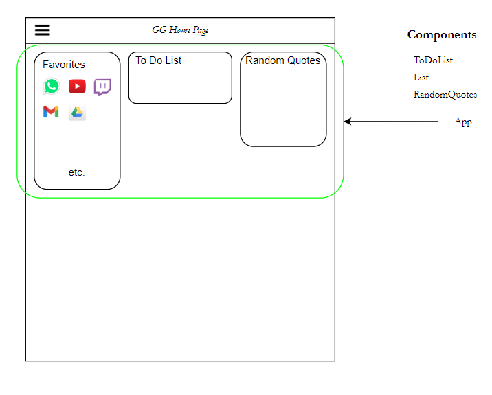

# GGHomePage

## Homepage Gianpaolo Grandis

Homepage con 3 funzionalità creata per migliorare le competenze in react.
Insieme a react ho installato react-bootstrap tramite il comanto npm install bootstrap ```npm install react-bootstrap bootstrap```

Per far funzionare il progetto bisogna eseguire i seguenti comanti:

``` 
    cd ./gg_homepage/
    npm start
```

Questo è lo schema approssimativo dei componenti che supponevo di utilizzare




